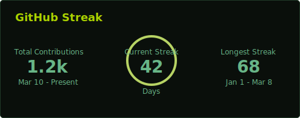
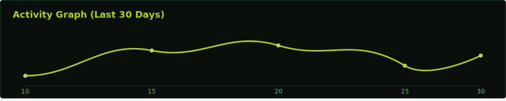

  

  

    <h1 align="center" style="color: #abd200;">
       Hi, I'm Nandan A M 
    </h1>
    <h3 align="center" style="color: #b7d364;">A Passionate Developer</h3>
  

 

  
  

 

  

 

  

 

<h3 align="left" style="color: #abd200;">// BIO_DATA</h3>

Hi, I’m <strong>Nandan A M</strong>, a passionate developer who loves turning ideas into impactful digital solutions. I work across web, mobile, and AI-driven systems, focusing on building secure, efficient, and scalable applications.

<ul style="list-style-type: square; color: #68b587;">
  <li>I’ve hands-on experience with Django, React, Laravel, MySQL, Android Studio, Git, and Docker.</li>
  <li>Currently exploring AI-based projects like handwriting recognition, cyber threat detection, and system optimization using intelligent models.</li>
  <li>Actively building full-stack & security-focused projects, including dashboards, monitoring systems, and smart automation tools.</li>
  <li>Outside coding, I enjoy tech challenges, hackathons, logic puzzles, and experimenting with new frameworks to sharpen my skills.</li>
</ul>

 

<h3 align="left" style="color: #abd200;">// SYSTEM_ASSETS: TECHNOLOGIES</h3>

 
   
   
   
   
   
   
   
   
   
   
   
   
   

 

<h3 align="left" style="color: #abd200;">// ESTABLISH_CONNECTION</h3> 

  

 

  [ STATUS: ALWAYS LEARNING. ALWAYS BUILDING. ALWAYS CURIOUS. ] 
  I love connecting with new people, so feel free to say hi! I'd be thrilled to get to know you better.

